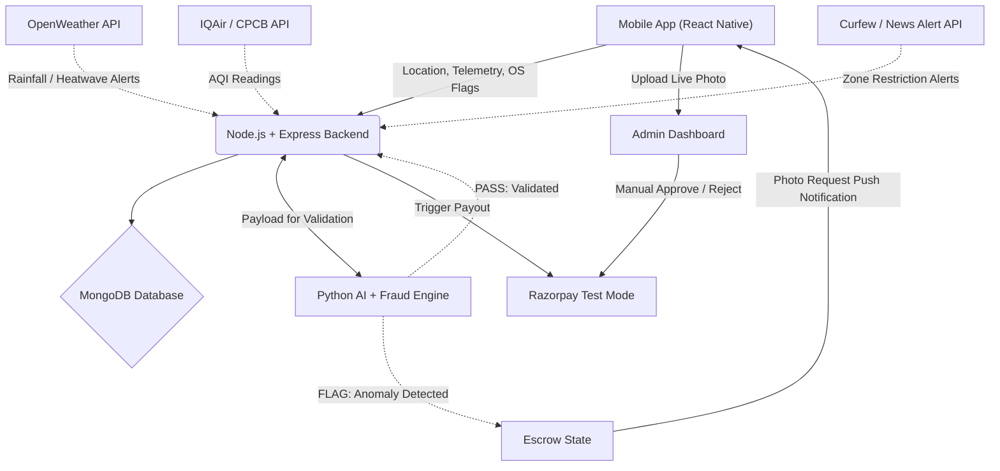

<div align="center">
  <h1>GigInsura</h1>
  <p><b>AI-Powered Parametric Insurance for Gig Workers</b></p>
  <p><i>“Smart protection for gig workers — when work stops, income doesn’t.”</i></p>

  [](#)
  [](#)
  [](#)
  [](#)
  
  <i>Built for Guidewire DEVTrails 2026: Unicorn Chase</i><br>
  <b>🎥 <a href="[INSERT_YOUTUBE_LINK_HERE]">Watch Our 2-Minute Phase 1 Pitch Video Here!</a></b>
</div>

---

## 📑 Table of Contents
1. [Overview](#-overview)
2. [Problem Statement](#-problem-statement)
3. [Our Solution](#-our-solution)
4. [Persona & Real-World Scenarios](#-persona--real-world-scenarios)
5. [Application Workflow](#-application-workflow)
6. [Pricing & Coverage Plans](#-pricing--coverage-plans)
7. [Parametric Triggers](#-parametric-triggers)
8. [AI/ML Integration Plan](#-aiml-integration-plan)
9. [Fraud Detection & Anti-Spoofing](#-fraud-detection--anti-spoofing)
10. [System Architecture](#-system-architecture)
11. [Tech Stack](#-tech-stack)
12. [Development Roadmap](#-development-roadmap)
13. [Local Installation & Setup](#-local-installation--setup)
14. [Contributors](#-contributors)

---

## 📌 Overview
**GigInsura** is an AI-powered parametric income insurance platform designed exclusively for food delivery partners (Zomato / Swiggy). It protects their weekly earnings from uncontrollable external disruptions — extreme weather, dangerous pollution levels, and area curfews — using real-time data, automated claim triggering, and instant payouts with zero paperwork.

**Coverage Scope:** Income loss ONLY. GigInsura strictly excludes health, accident, life insurance, and vehicle repair coverage.

## 🎯 Problem Statement
India's food delivery partners are the backbone of the urban economy — yet they carry 100% of the financial risk from disruptions they cannot control. A single heavy-rain day or a curfew can wipe out ₹500–₹1,000 of daily income with no safety net.

| The Reality | The Gap |
| :--- | :--- |
| **20–30% monthly income lost to disruptions** | No income protection product exists for gig workers |
| **Disruptions are measurable & verifiable** | Insurance is inaccessible, slow, and paperwork-heavy |
| **Workers earn and spend week-to-week** | Existing products are annual/monthly, not weekly |

## 💡 Our Solution
GigInsura provides a fully automated, weekly parametric income protection system for Zomato/Swiggy delivery partners.

### Key Features
* 🧾 **Smart Onboarding** — Select platform, enter average weekly earnings, receive AI-generated risk profile and recommended plan.
* 🤖 **AI Risk Assessment** — Predicts disruption probability from weather, AQI, and location history. Dynamically adjusts weekly premium.
* ⚡ **Parametric Insurance** — Claims auto-triggered by real-world data. No manual filing, no calls, no forms.
* 📊 **Dual Dashboard** — Worker-facing earnings tracker + Admin analytics and fraud monitoring.
* 🔐 **Fraud Detection** — GPS velocity checks, OS-level mock-provider flags, and asynchronous photo escrow.

## 👤 Persona & Real-World Scenarios
**Target Persona:** Food delivery partners working on Zomato and/or Swiggy in metro Indian cities (Delhi, Mumbai, Bengaluru, Hyderabad). Typically aged 20–35, earning ₹8,000–₹15,000/month, operating 6–8 hours/day, living gig-to-gig with no employer benefits.

### Scenario 1 — Heavy Rainfall (Environmental Disruption)
Raju, 27, delivers for Zomato in South Delhi. On a Tuesday afternoon, monsoon rainfall exceeds 55mm/hour in his zone. Zomato's order volume drops 80%. Raju parks his bike and cannot work for 4 hours.

* **Without GigInsura:** Raju loses ~₹400 with no recourse.
* **With GigInsura (Standard Plan):**
  1. GigInsura's weather monitor detects rainfall > 50mm in Raju's registered zone.
  2. System cross-checks Raju's GPS — he is stationary in the affected area.
  3. Fraud engine clears the claim in seconds.
  4. ₹400 payout is credited to Raju's UPI within minutes.
  5. Raju receives a push notification: "Disruption detected. ₹400 credited. Stay safe."

### Scenario 2 — Hazardous Air Quality (Environmental Disruption)
Priya, 24, delivers for Swiggy in Noida. Delhi's AQI spikes to 430 (Severe category) on a winter morning. Government issues an advisory against outdoor activity for sensitive populations. Order counts fall dramatically.

* **Without GigInsura:** Priya loses a full morning shift (~₹350) and risks her health.
* **With GigInsura (Pro Plan):**
  1. GigInsura's AQI feed (IQAir/CPCB API) detects AQI > 400 in Noida.
  2. Automated claim is initiated. Payout of ₹700 (pro-rated for daily cap) is processed.
  3. Priya also receives an in-app air quality alert suggesting she stay home.

### Scenario 3 — Curfew / Area Restriction (Social Disruption)
Arjun, 31, covers the Old Delhi zone for Zomato. A local communal tension triggers a Section 144 order in his area at 6 PM. He cannot access his primary delivery zone for 3 hours.

* **Without GigInsura:** Arjun loses his peak-hour earnings (~₹500–₹600).
* **With GigInsura (Standard Plan):**
  1. GigInsura receives a curfew alert via government/news API integration.
  2. Arjun's GPS confirms he attempted to operate in the restricted zone.
  3. Claim auto-triggers. ₹400 payout is processed.
  4. Admin dashboard flags the event zone for risk recalculation next week.

### Scenario 4 — Fraudulent Claim Attempt (Anti-Fraud Flow)
A bad actor installs a GPS spoofing app and attempts to fake their location inside a rainfall zone without actually being there.

* **GigInsura's Response:**
  1. GPS coordinates show the user "teleporting" 8km in 3 seconds — velocity anomaly flagged.
  2. OS-level check detects a mock location provider app active on the device.
  3. Claim is moved to Escrow state — NOT instantly rejected.
  4. User receives a push: "We need a quick photo of your current surroundings to verify your claim."
  5. No valid photo submitted → Claim denied. Honest users in genuine disruptions can submit photo and get cleared by Admin.

## 🔄 Application Workflow
```text
Worker Opens App
      │
      ▼
[Onboarding]
  - Select platform (Zomato / Swiggy)
  - Enter average weekly earnings
  - Allow location permission
  - AI generates Risk Score (Low / Medium / High)
      │
      ▼
[Plan Selection & Premium Calculation]
  - Choose Basic / Standard / Pro
  - AI adjusts price based on hyper-local risk score
  - Weekly premium deducted automatically
      │
      ▼
[Active Coverage — Real-Time Monitoring]
  - Weather / AQI / Curfew APIs polled continuously
  - Worker GPS telemetry checked every 2 minutes
      │
      ▼
[Disruption Detected]
  - Parametric trigger threshold crossed?
       ├── YES → Fraud Engine validates GPS + OS flags
       │              ├── PASS → Instant Payout via Razorpay
       │              └── FAIL → Escrow → Photo Request → Admin Review
       └── NO  → Coverage continues silently
      │
      ▼
[Worker Dashboard]
  - Payout history
  - Active coverage status
  - Real-time disruption alerts
```

## 💰 Pricing & Coverage Plans
GigInsura uses a weekly subscription model, aligned with the payout cycle of gig workers. Premiums are dynamically adjusted by the AI risk engine.

| Plan | Base Weekly Premium | Weekly Payout Cap | Best For |
| :--- | :--- | :--- | :--- |
| **Basic** | ₹15/week | ₹200 | Part-time, low-risk zones |
| **Standard** | ₹30/week | ₹400 | Full-time, moderate-risk zones |
| **Pro** | ₹50/week | ₹700 | High-income, high-risk zones |

**Dynamic Premium Formula:**
`Final Weekly Premium = Base Price + (Risk Score × Adjustment Factor)`
* **Risk Score** is output by the ML model (0.0 – 1.0).
* **Adjustment Factor** is calibrated per zone based on historical disruption frequency.
*(Example: A worker in a flood-prone zone may pay ₹5–₹10 more per week than a low-risk counterpart.)*

**Why Weekly?** Gig workers receive platform payouts weekly. A weekly insurance cycle eliminates the barrier of upfront annual/monthly premiums that most gig workers cannot afford.

## ⚡ Parametric Triggers
Claims are triggered automatically when measurable real-world thresholds are crossed—no manual filing required.

| Trigger | Data Source | Threshold | Outcome |
| :--- | :--- | :--- | :--- |
| **Heavy Rain** | OpenWeatherMap API | Rainfall > 50mm/hr | Instant payout |
| **Severe Pollution** | IQAir / CPCB API | AQI > 400 | Instant payout |
| **Curfew / Section 144** | News + Govt. Alert APIs | Active zone restriction | Instant payout |
| **Heatwave** | OpenWeatherMap API | Temperature > 45°C | Instant payout |
| **Flash Flood / Waterlogging**| Civic alert APIs (mock) | Zone flood advisory active| Instant payout |

**Platform Choice — Mobile (React Native):** Chosen because delivery partners are mobile-first. GPS telemetry, push notifications for alerts, and photo upload for escrow resolution all require native mobile capabilities. A web-only solution would miss the real-time, on-road experience.

## 🧠 AI/ML Integration Plan
### 1. Risk Assessment & Dynamic Premium Pricing
* **Model:** Logistic Regression → Random Forest
* **Inputs:** Worker's home zone, delivery zone cluster, historical weather events, AQI trends, curfew frequency, time-of-year seasonality
* **Output:** Risk Score (Low / Medium / High) used to adjust weekly premium

### 2. Fraud Detection
* **Model:** Isolation Forest (unsupervised anomaly detection)
* **Inputs:** GPS coordinates + timestamps, OS mock-provider flag, static IP persistence, claim frequency per worker
* **Output:** PASS (auto-approve) / FLAG (route to escrow)

### 3. Predictive Disruption Forecasting (Phase 3)
* **Model:** Time-series forecasting (Prophet / LSTM)
* **Purpose:** Admin dashboard — predict next week's likely claim volume by zone for insurer risk management

## 🛡️ Fraud Detection & Anti-Spoofing
GigInsura's fraud architecture operates on three independent layers:
1. **Layer 1 — Algorithmic Teleportation & Velocity Validation:** The backend continuously calculates the time-distance delta between GPS pings. Any traversal physically impossible for a delivery vehicle (e.g., 10km in 2 seconds) is instantly classified as a spoofed coordinate.
2. **Layer 2 — Native OS Mock-Provider Flags & Network Fingerprinting:** Instead of relying purely on lat/long, the app extracts OS-level flags that detect fake GPS applications. This is cross-referenced with network IP data: a genuine moving worker transitions across cellular towers, while a stationary spoofer maintains a suspiciously static residential IP alongside rapidly shifting coordinates.
3. **Layer 3 — Asynchronous Escrow & Photographic Verification:** Flagged claims are never instantly rejected — extreme weather can cause genuine GPS jitter. Instead, claims are placed in an Escrow state and the worker receives an empathetic push notification requesting a live contextual photo (e.g., a real-time image of the flooded street). This shifts the burden of proof to localized visual confirmation, penalizing spoofers while preserving the trust of honest workers.

## ⚙️ System Architecture




## 🧩 Tech Stack
| Layer | Technology | Justification |
| :--- | :--- | :--- |
| **Frontend** | React Native | Cross-platform mobile, GPS access, push notifications |
| **Backend** | Node.js + Express | Fast async I/O, ideal for real-time API polling |
| **AI/ML Engine** | Python (Scikit-learn) | Random Forest for risk scoring, Isolation Forest for fraud |
| **Database** | MongoDB | Flexible schema for worker profiles, claims, telemetry logs |
| **Weather API** | OpenWeatherMap | Real-time rainfall and temperature data |
| **AQI API** | IQAir / CPCB | Hyper-local pollution index |
| **Payments** | Razorpay (Test Mode)| Widely used in India, easy UPI simulation |

## 🗺️ Development Roadmap
**✅ Phase 1 [March 4–20] — Ideation & Foundation 🦄** 
- [x] Problem analysis and persona definition
- [x] Core strategy documentation (this README)
- [x] System architecture design
- [x] GitHub repository setup
- [x] Phase 1 video walkthrough

**🔨 Phase 2 [March 21 – April 4] — Automation & Protection 🛡️** 
- [ ] React Native mobile frontend (onboarding, dashboard, alerts)
- [ ] Node.js + Express backend (worker registration, policy management)
- [ ] MongoDB schema setup (workers, policies, claims, telemetry)
- [ ] Python ML models (Random Forest risk scorer, Isolation Forest fraud detector)
- [ ] 3–5 automated parametric trigger integrations (Weather, AQI, Curfew APIs)
- [ ] Dynamic premium calculation engine
- [ ] Zero-touch claims flow (auto-trigger → fraud check → payout or escrow)

**📈 Phase 3 [April 5–17] — Scale & Optimise 🚀** 
- [ ] Advanced fraud detection (velocity checks, OS flags, IP fingerprinting)
- [ ] Razorpay test mode payout simulation
- [ ] Worker dashboard (earnings protected, active coverage, payout history)
- [ ] Admin/Insurer dashboard (claims analytics, risk heatmaps, predictive forecasting)

## 💻 Local Installation & Setup
```bash
# Clone the repository
git clone https://github.com/your-username/GigInsura.git
cd GigInsura

# Frontend (React Native)
cd frontend
npm install
npx react-native start

# Backend (Node.js)
cd ../backend
npm install
cp .env.example .env   
npm run dev

# AI/ML Engine (Python)
cd ../ml
pip install -r requirements.txt
python app.py
```
**Environment variables required (.env):**
```env
OPENWEATHER_API_KEY=your_key_here
IQAIR_API_KEY=your_key_here
RAZORPAY_KEY_ID=your_test_key
RAZORPAY_KEY_SECRET=your_test_secret
MONGODB_URI=mongodb://localhost:27017/giginsura
```

## 👨‍💻 Contributors
| Name | Role |
| :--- | :--- |
| **Satvik Chaurasia** | Lead Developer |
| **Raghvendra Chauhan** | Backend & ML |
| **Suryansh Chauhan** | Frontend & UX |
| **Samarth Kesari** | AI/ML Models |
| **Gargi Sharma** | Research & Strategy |
