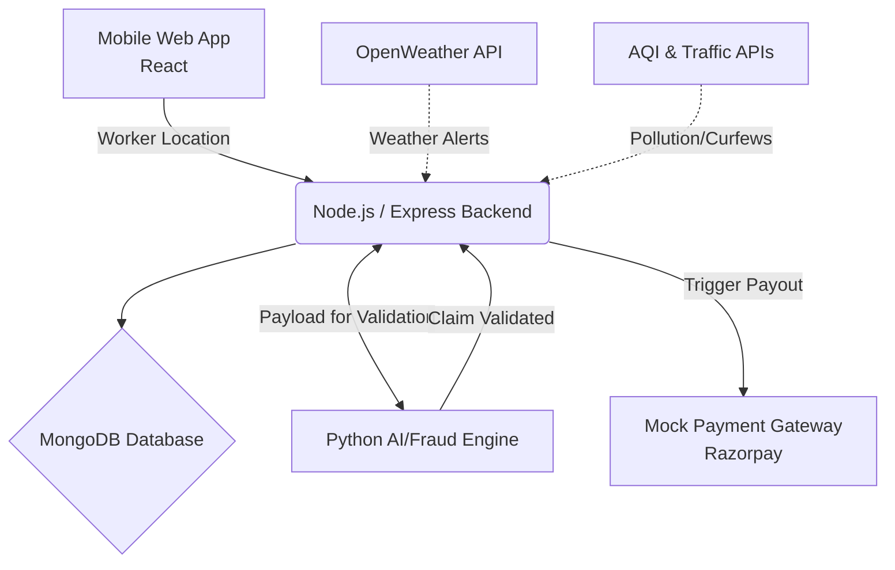

  <h1>🚀 GigInsura</h1>
  
<b>Smart protection for gig workers — when work stops, income doesn’t.</b>

  
  
  
  
  
  
  <i>Built for Guidewire DEVTrails 2026: Unicorn Chase</i>

---

## 📑 Table of Contents
1. [Overview](#-overview)
2. [Problem Statement](#-problem-statement)
3. [Our Solution](#-our-solution)
4. [Pricing & Coverage Plans](#-pricing--coverage-plans)
5. [Parametric Triggers & Dashboard](#-parametric-triggers--dashboard)
6. [System Architecture](#-system-architecture)
7. [AI/ML Models & Fraud Detection](#-aiml-models--fraud-detection)
8. [Workflow & Demo Flow](#-workflow--demo-flow)
9. [Tech Stack](#-tech-stack)
10. [Development Roadmap](#-development-roadmap)
11. [Contributors](#-contributors)

---

## 📌 Overview
**GigInsura** is an AI-powered parametric insurance platform designed to safeguard gig workers (delivery partners) from **income loss caused by external disruptions** such as extreme weather, pollution, and curfews.

Unlike traditional insurance systems, GigInsura leverages real-time data monitoring, AI-driven risk assessment, and automated claim triggering to provide **instant payouts with zero paperwork**.

## 🎯 Problem Statement
Gig workers in India often lose **20–30% of their income** due to uncontrollable external factors like:
* 🌧 Heavy rain / floods
* 🌡 Heatwaves / high pollution
* 🚓 Curfews, strikes, or area restrictions

Currently, they carry 100% of this financial risk with no structured safety net to protect their daily earnings.

## 💡 Our Solution
GigInsura provides a **fully automated income protection system** focused *exclusively* on income loss (strictly excluding health, accident, or vehicle insurance).

### Key Features
* 🧾 **Smart Onboarding:** Select platform (Zomato/Swiggy), enter earnings, receive AI risk profile.
* 🤖 **AI Risk Assessment:** Predicts disruption probability using weather, location, and AQI patterns.
* ⚡ **Parametric Insurance:** Auto-claims triggered by real-world conditions. No manual filing.
* 🔐 **Fraud Detection:** GPS spoofing and anomaly detection.

## 💰 Pricing & Coverage Plans
We operate on a **weekly subscription model**, mapping perfectly to the payout cycle of gig workers.

| Plan | Base Price | Coverage |
| :--- | :--- | :--- |
| **Basic** | ₹15/week | ₹200 payout |
| **Standard** | ₹30/week | ₹400 payout |
| **Pro** | ₹50/week | ₹700 payout |
*Note: Premiums are adjusted dynamically by AI based on hyper-local risk scores.*

## ⚡ Parametric Triggers & Dashboard
Claims are triggered automatically via active data streams:

| Condition | Trigger Event | Payout |
| :--- | :--- | :--- |
| Rain > 50mm | Delivery disruption | Instant payout limit |
| AQI > 400 | Unsafe outdoor conditions | Instant payout limit |
| Curfew Alert | Area inaccessible | Instant payout limit |

**Intelligent Dashboard:**
* **Worker:** Active coverage status, earnings protected, real-time alerts.
* **Admin:** Claims analytics, risk heatmaps, fraud monitoring.

## ⚙️ System Architecture

## 🧠 AI/ML Models & Fraud Detection
* **Risk Prediction (Logistic Regression / Random Forest):** Outputs Low/Medium/High risk score based on predictive data.
* **Dynamic Pricing:** `Weekly Premium = Base Price + (Risk Score × Factor)`
* **Fraud Detection (Isolation Forest):** Identifies unusual claim patterns, GPS spoofing, and duplicate claims.

## 🔄 Workflow & Demo Flow
1. **Onboarding:** Worker registers, selects a plan, and AI calculates their risk score.
2. **Weekly Deduction:** Dynamically generated premium is set.
3. **The Disruption:** A disruption is simulated (e.g., heavy rainfall > 50mm).
4. **Trigger & Validation:** System monitors real-time APIs. Fraud model analyzes GPS telemetry (e.g., verifying the worker is halted at the affected location).
5. **Instant Payout:** Claim is auto-generated and payout is instantly processed via Razorpay Test Mode.

## 🧩 Tech Stack
* **Frontend:** React / React Native
* **Backend:** Node.js + Express
* **AI/ML:** Python (Scikit-learn)
* **Database:** MongoDB
* **APIs:** OpenWeather API, AQI API
* **Payments:** Razorpay (Test Mode)

## 🗺️ Development Roadmap
**Phase 1 (March 4 - 20) : Ideation & Foundation 🦄** 
- [x] Strategy documentation, Idea Document, Architecture planning, and Git repository setup.

**Phase 2 (March 21 - April 4) : Automation & Protection 🛡️** 
- [ ] Implement Mobile Frontend and Express Backend.
- [ ] Build AI Models (Random Forest / Isolation Forest).
- [ ] Integrate Automated API Triggers.

**Phase 3 (April 5 - 17) : Scale & Optimise 📈** 
- [ ] Real-time payout simulation using Razorpay.
- [ ] Finalize intelligent Dashboard.

---

## 👨‍💻 Contributors
* **Satvik Chaurasia**
* **Raghvendra Chauhan**
* **Suryansh Chauhan**
* **Samarth Keshari**
* **Gargi Sharma**
